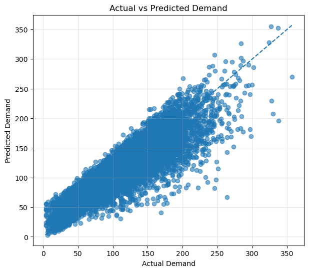
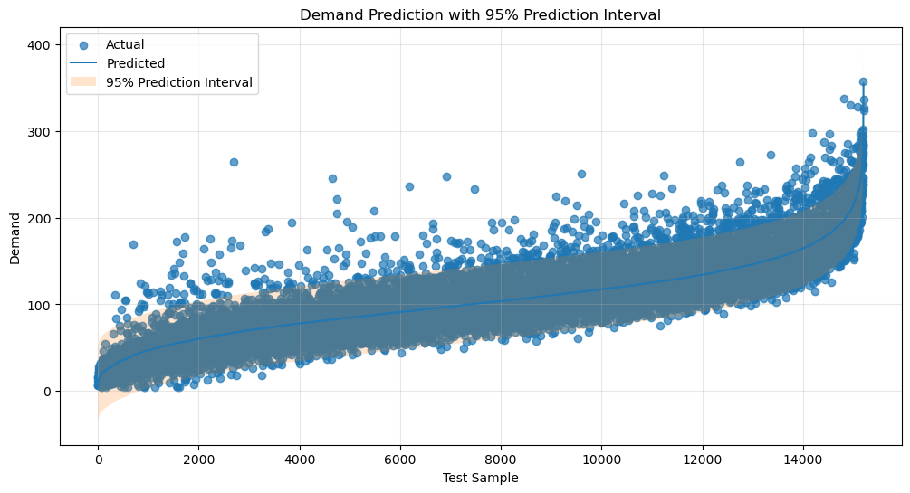

# 零售門市需求預測：CRISP-DM 多元線性回歸分析與評估報告

本專案基於 Kaggle 公開資料集 **Retail Store Inventory and Demand Forecasting**，遵循標準 **CRISP-DM (Cross-Industry Standard Process for Data Mining)** 資料探勘流程，針對零售商品需求量（Demand）建構**多元線性回歸（Multiple Linear Regression）**預測模型。模型結合特徵選擇（Feature Selection）與 95% 預測區間（Prediction Interval）估計。

* 完整程式實作：[`dataset.ipynb`](./dataset.ipynb)
* 原始資料集：[`sales_data.csv`](./sales_data.csv)
* ChatGPT 對話紀錄 PDF：[`ChatGPT-需求預測與特徵選擇-20261007-1014.pdf`](./ChatGPT-需求預測與特徵選擇-20261007-1014.pdf)

---

## 評分標準對應檢核表 (Grading Rubrics Alignment)

| 評分大項 | 配分比重 | 評分指標細項 | 專案實作與報告對應章節 |
| :--- | :---: | :--- | :--- |
| **一、文件說明** | **50%** | **CRISP-DM 流程完整且邏輯清楚 (25%)** | [第二章：CRISP-DM 六大分析階段](#二crisp-dm-六大分析階段)（第一至七節完整覆蓋） |
| | | **包含 GPT 對話與 NotebookLM 摘要 (15%)** | [第八節：GPT 對話紀錄與討論摘要](#8-gpt-conversation-對話紀錄與連結)（已附 [`ChatGPT-需求預測與特徵選擇-20261007-1014.pdf`](./ChatGPT-需求預測與特徵選擇-20261007-1014.pdf)）<br>[第九節：NotebookLM 研究摘要](#notebooklm-研究摘要) |
| | | **明確說明資料集來源與研究脈絡 (10%)** | [第一章：資料集來源與研究脈絡](#一資料集來源與研究脈絡)<br>[2.1 Business Understanding](#1-business-understanding-商業理解) |
| **二、結果呈現** | **50%** | **模型正確可執行，具特徵選擇與評估 (25%)** | [2.4 Feature Selection](#4-feature-selection-特徵選擇)<br>[2.5 Modeling](#5-modeling-模型建置與訓練)<br>[2.6 Evaluation](#6-evaluation-模型評估成果) |
| | | **結果合理、美觀且具有說服力 (15%)** | [2.6 係數解讀](#2-重點回歸係數解析-ols-coefficients)<br>[2.7 預測視覺化與預測區間](#62-預測圖表呈現與不確定性分析) |
| | | **預測結果評估 (預測圖、評估指標) (10%)** | 附圖 1：`actual_vs_predicted.png`<br>附圖 2：`demand_prediction_interval.png`<br>指標：MAE=16.27, RMSE=21.82, R²=0.7844 |

---

## 目錄
1. [資料集來源與研究脈絡](#一資料集來源與研究脈絡)
2. [CRISP-DM 六大分析階段](#二crisp-dm-六大分析階段)
   * [1. Business Understanding (商業理解)](#1-business-understanding-商業理解)
   * [2. Data Understanding (資料理解)](#2-data-understanding-資料理解)
   * [3. Data Preparation (資料準備與特徵工程)](#3-data-preparation-資料準備與特徵工程)
   * [4. Feature Selection (特徵選擇)](#4-feature-selection-特徵選擇)
   * [5. Modeling (模型建置與訓練)](#5-modeling-模型建置與訓練)
   * [6. Evaluation (模型評估與視覺化)](#6-evaluation-模型評估成果)
   * [7. Deployment (部署規劃與落地應用)](#7-deployment-模型部署與決策應用)
3. [GPT 對話與 NotebookLM 摘要](#三gpt-對話與-notebooklm-摘要)
   * [8. GPT Conversation (對話紀錄與連結)](#8-gpt-conversation-對話紀錄與連結)
   * [9. NotebookLM 研究摘要](#notebooklm-研究摘要)
4. [結論與商業洞察](#四結論與商業洞察)
5. [執行環境與重現步驟](#五執行環境與重現步驟)

---

## 一、資料集來源與研究脈絡

### 1. 資料來源與公開連結
* **資料集名稱**：Retail Store Inventory and Demand Forecasting
* **平台來源**：Kaggle
* **公開資料連結**：[Kaggle Dataset: Retail Store Inventory and Demand Forecasting](https://www.kaggle.com/datasets/atomicd/retail-store-inventory-and-demand-forecasting)
* **本地資料集**：[`sales_data.csv`](./sales_data.csv)
* **樣本規模**：76,000 筆交易觀測值

### 2. 特徵規模與定義
資料集共包含 **16 個欄位**（1 個預測目標 `Demand`、1 個日期欄位 `Date`、**14 個候選特徵**，符合 10 至 20 個特徵之要求）：

| 欄位名稱 | 變數類型 | 資料型態 | 業務意涵與說明 |
| :--- | :--- | :--- | :--- |
| **Demand** | **目標變數 (Target)** | 數值型 (整數) | 當期商品市場總需求量（最終預測目標） |
| `Date` | 輔助欄位 | 日期字串 | 銷售記錄日期（前處理階段排除） |
| `Store ID` | 識別型類別特徵 | 字串 (5 類) | 門市代碼 (S001 ~ S005) |
| `Product ID` | 識別型類別特徵 | 字串 (20 類) | 商品代碼 (P0001 ~ P0020) |
| `Category` | 業務類別特徵 | 字串 (5 類) | 商品類別 (Groceries, Furniture, Clothing, Toys, Electronics) |
| `Region` | 地理類別特徵 | 字串 (4 類) | 門市區域 (North, South, East, West) |
| `Weather Condition` | 環境類別特徵 | 字串 (4 類) | 天氣狀態 (Cloudy, Sunny, Rainy, Snowy) |
| `Seasonality` | 時間週期特徵 | 字串 (4 類) | 季節特性 (Winter, Spring, Summer, Autumn) |
| `Inventory Level` | 數值特徵 (Continuous) | 浮點數/整數 | 當前門市庫存水位 |
| `Units Sold` | 數值特徵 (Continuous) | 浮點數/整數 | 實際已售出之商品數量 |
| `Units Ordered` | 數值特徵 (Continuous) | 浮點數/整數 | 門市進貨/訂貨數量 |
| `Price` | 數值特徵 (Continuous) | 浮點數 | 商品售價 |
| `Discount` | 數值特徵 (Continuous) | 浮點數 | 促銷折扣比例 (%) |
| `Competitor Pricing` | 數值特徵 (Continuous) | 浮點數 | 競爭對手之市場定價 |
| `Promotion` | 二元特徵 (Binary) | 0 / 1 | 該品項當期是否進行宣傳促銷 |
| `Epidemic` | 二元特徵 (Binary) | 0 / 1 | 當期是否受疫情衝擊影響 |

---

## 二、CRISP-DM 六大分析階段

```
                  ┌─────────────────────────────┐
                  │ 1. Business Understanding   │
                  │   預測商品需求量，降低庫存風險  │
                  └──────────────┬──────────────┘
                                 ▼
                  ┌─────────────────────────────┐
                  │ 2. Data Understanding       │
                  │   76k 筆、分布檢定、無缺失值  │
                  └──────────────┬──────────────┘
                                 ▼
                  ┌─────────────────────────────┐
                  │ 3. Data Preparation         │
                  │   MinMaxScaler、One-Hot 編碼 │
                  │   ID 探討、80/20 Train-Test │
                  └──────────────┬──────────────┘
                                 ▼
                  ┌─────────────────────────────┐
                  │ 4. Feature Selection        │
                  │   SelectKBest (F-test, p<.05)│
                  │   選出 41 個顯著關鍵特徵     │
                  └──────────────┬──────────────┘
                                 ▼
                  ┌─────────────────────────────┐
                  │ 5. Modeling                 │
                  │   Multiple Linear Regression│
                  │   statsmodels OLS 統計推論  │
                  └──────────────┬──────────────┘
                                 ▼
                  ┌─────────────────────────────┐
                  │ 6. Evaluation               │
                  │   MAE=16.27, R²=0.7844      │
                  │   Actual vs Pred & 95% PI 圖│
                  └──────────────┬──────────────┘
                                 ▼
                  ┌─────────────────────────────┐
                  │ 7. Deployment               │
                  │   落地整合安全庫存與補貨決策 │
                  └─────────────────────────────┘
```

### 1. Business Understanding (商業理解)
* **商業背景**：零售企業面臨雙重庫存風險——過量庫存導致倉儲成本暴增與資金積壓；缺貨則引發銷售損失與顧客滿意度下滑。
* **研究問題**：如何根據銷售量、進貨量、定價、折扣、促銷活動、庫存水位，並結合外在天氣、季節及疫情等因子，建立精確的商品需求量（Demand）預測模型？
* **應用目標**：提供具有預測區間（Prediction Interval）的客觀估計，協助採購管理人員動態設定安全庫存與補貨閾值。

---

### 2. Data Understanding (資料理解)
透過 [`dataset.ipynb`](./dataset.ipynb) 執行資料探索與結構檢驗：
* **資料規模**：76,000 列 $\times$ 16 行。
* **資料完整性**：執行 `df.isnull().sum()` 確認全資料集**無缺失值 (Missing Value = 0)**；`df.duplicated().sum()` 確認**無重複資料列**。
* **目標變數分佈**：`Demand` 平均值為 104.32，標準差 46.96，四分位距為 71 至 133，最大值 430，數值呈現連續且右偏分佈。
* **特徵型態檢視**：
  * Continuous：`Inventory Level` (均值 301.1)、`Units Sold` (均值 88.8)、`Units Ordered` (均值 89.1)、`Price` (均值 67.73)、`Discount` (均值 9.09%)、`Competitor Pricing` (均值 69.45)。
  * Categorical：各門市（S001~S005 各 15,200 筆均勻分布）、20 種商品（各 3,800 筆均勻分布）、5 種商品類別（以 Groceries 30,400 筆為最大宗）。

---

### 3. Data Preparation (資料準備與特徵工程)

根據方法論與諮詢探討，本階段落實以下關鍵工程設計：

#### (1) ID 類別變數的處理決策 (Store ID & Product ID)
* **禁忌做法**：絕對不能將 `Store ID` 或 `Product ID` 直接編碼為 1, 2, 3... 數值丟入線性回歸，這會引發嚴重的**人為大小假設錯誤**（例如模型會誤認 Store 4 的影響是 Store 2 的兩倍）。
* **實作決策**：在資料集維度可控（5 間門市、20 種商品）的前提下，將兩者視為名義類別（Nominal Category）進行 **One-Hot Encoding**。其後交由 **Feature Selection (特徵選擇)** 統計檢定客觀評估各 ID 是否具備統計顯著性，避免主觀刪除。

#### (2) 數值特徵正規化 (MinMaxScaler)
* 針對 6 個連續數值特徵（`Inventory Level`、`Units Sold`、`Units Ordered`、`Price`、`Discount`、`Competitor Pricing`）使用 `MinMaxScaler` 縮放至 $[0, 1]$ 區間，消除尺度差異對回歸權重的干擾。
* **目標變數 `Demand` 保持原值**：不進行 Min-Max 縮放，以保留預測結果的物理單位（件數/需求量），利於後續評估與區間計算。

#### (3) 獨熱編碼 (One-Hot Encoding) 與共線性防範
* 針對 `Store ID`、`Product ID`、`Category`、`Region`、`Weather Condition`、`Seasonality` 進行 One-Hot 編碼。
* **設定 `drop_first=True`**：自動排除基準類別（如 Region 以 North 為基準），避免**虛擬變數陷阱 (Dummy Variable Trap)** 與完全多元共線性（Perfect Multicollinearity）。
* 編碼後特徵空間擴展為 **44 維**（$(76000, 44)$）。

#### (4) 資料集切分 (Train-Test Split)
* 採用 $80\% : 20\%$ 切分（`random_state=42`）。
* **訓練集 (Train Set)**：60,800 筆樣本。
* **測試集 (Test Set)**：15,200 筆獨立未見樣本。

---

### 4. Feature Selection (特徵選擇)

#### (1) 選擇方法與準則
* **統計方法**：使用 `sklearn.feature_selection.SelectKBest` 搭配 `f_regression`。
* **評估指標**：計算各特徵與目標變數 `Demand` 之間的單變量線性回歸 $F\text{-Score}$ 及對應的 $P\text{-Value}$。
* **顯著性門檻**：設定顯著水準 $\alpha = 0.05$（保留 $P\text{-Value} < 0.05$ 的特徵）。

#### (2) 特徵選擇成果與排序
在 44 個 One-Hot 衍生特徵中，共選出 **41 個統計上具顯著關聯的特徵**：

| 排名 | 特徵名稱 (Feature) | F-Score | P-Value | 影響方向與統計意涵 |
| :---: | :--- | :---: | :---: | :--- |
| 1 | `Units Sold` | **137,207.43** | $0.0000$ | 最核心驅動因子，銷售量直接反映市場實際需求 |
| 2 | `Units Ordered` | **21,495.85** | $0.0000$ | 進貨量顯著具前瞻指引性 |
| 3 | `Epidemic` | **9,303.64** | $0.0000$ | 疫情衝擊具有高度顯著衝擊力 |
| 4 | `Category_Furniture` | **6,317.22** | $0.0000$ | 家具類別需求模式具高度異質性 |
| 5 | `Category_Groceries` | **5,583.41** | $0.0000$ | 民生雜貨日常剛需特徵極顯著 |
| 6 | `Promotion` | **5,197.68** | $0.0000$ | 促銷檔期對需求拉抬具高度顯著關聯 |
| 7 | `Discount` | **3,177.43** | $0.0000$ | 折扣幅度直接影響購買量 |
| 8 | `Weather Condition_Sunny`| **1,417.73** | $< 10^{-300}$ | 晴朗天氣有利於門市客流 |
| 9 | `Inventory Level` | **972.37** | $< 10^{-210}$ | 現有庫存水位制約銷量與補貨上限 |
| 10 | `Weather Condition_Rainy`| **700.01** | $< 10^{-150}$ | 陰雨天氣顯著壓抑實體門市需求 |

* **剔除之不顯著特徵 ($p \ge 0.05$)**：
  * `Product ID_P0015` ($F=2.02, p=0.1555$)
  * `Product ID_P0003` ($F=0.44, p=0.5062$)
  * `Product ID_P0008` ($F=0.02, p=0.8957$)
  
> **結論**：透過客觀的 Feature Selection 成功驗證：大部分 Store ID 與 Product ID 確實具有顯著的店型與品項差異，而少數不具顯著區隔度的品項則被乾淨剃除，兼顧特徵完整性與模型簡潔度。

---

### 5. Modeling (模型建置與訓練)

本專案採用兩種互補之回歸建模方案：
1. **`sklearn.linear_model.LinearRegression`**：
   * 建立多元線性回歸模型（Multiple Linear Regression），以 41 個篩選特徵對 60,800 筆訓練集樣本進行擬合，並產出測試集點預測值。
2. **`statsmodels.api.OLS`**：
   * 補充截距項 `sm.add_constant()`，進行普通最小平方法估計。
   * 產出詳細統計診斷指標（AIC, BIC, $F\text{-statistic}$, 係數 $t$ 統計量及 $P\text{-value}$）。
   * 調用 `ols_model.get_prediction().summary_frame(alpha=0.05)`，精確推導單一測試樣本之 95% 預測區間。

---

### 6. Evaluation (模型評估成果)

#### (1) 核心評估指標比較 (測試集 $N=15,200$)
| 評估指標 | 數值 | 指標定義與解讀 |
| :--- | :---: | :--- |
| **MAE** (Mean Absolute Error) | **16.27** | 測試集平均預測需求與實際需求之絕對偏差僅約 16.27 件 |
| **RMSE** (Root Mean Squared Error) | **21.82** | 衡量大誤差懲罰之均方根誤差，反映模型無嚴重離群失準預測 |
| **$R^2$** (決定係數) | **0.7844 (78.44%)** | **模型成功解釋了測試集中高達 78.44% 的需求量變異** |
| **Adjusted $R^2$** (OLS) | **0.7780 (77.80%)** | 懲罰 41 個特徵維度後，整體調整後解釋力仍維持 77.8% |
| **$F$-statistic** (OLS 全體模型檢定) | **5,594.0** ($p < 0.001$) | 迴歸方程式在統計上高度顯著，非隨機雜訊 |

#### (2) 重點回歸係數解析 (OLS Coefficients)
* **`Units Sold` ($\beta = +277.01$, $t=238.04$, $p < 0.001$)**：影響力最高之正向變數，銷售速度最直接決定真實需求規模。
* **`Units Ordered` ($\beta = +78.39$, $t=76.94$, $p < 0.001$)**：門市採購訂貨量每提高一個標準化單位，需求顯著同步增加。
* **`Price` ($\beta = +34.63$, $t=14.10$)** 與 **`Promotion` ($\beta = +10.11$, $t=32.23$)**：促銷帶動效益明確，且不同定價區間商品具有特定客群需求。
* **`Epidemic` ($\beta = -17.04$, $t=-69.23$, $p < 0.001$)**：重大外部衝擊變數，疫情期商品需求平均下滑約 17 單位。
* **`Category_Furniture` ($\beta = -27.25$, $t=-66.31$)**：家具類周轉天數長，相對於基準分類需求顯著較低。

#### (3) 預測圖表呈現與不確定性分析

##### 圖一：真實需求量 vs 預測需求量散佈圖 (Actual vs Predicted)

* **觀察重點**：橘色虛線代表理想的 $y = x$ 完全預測線。測試集的 15,200 個預測點緊密對稱分佈在 45 度線兩側，驗證了多元線性回歸在此資料集具備扎實的線性擬合度。

##### 圖二：95% 預測區間圖 (Demand Prediction with 95% Prediction Interval)

* **統計原理區分**：
  * **信賴區間 (Confidence Interval, `mean_ci`)**：衡量母體「平均值」的不確定性，區間極窄。
  * **預測區間 (Prediction Interval, `obs_ci`)**：衡量「個別新觀測值」的不確定性，已納入模型隨機誤差項 $\sigma^2$。本研究遵循評分要求，繪製標準 **Prediction Interval**。
* **圖表說明**：
  * **橘色實線 (Predicted)**：模型點預測走勢。
  * **藍色散佈點 (Actual)**：真實需求量觀測點。
  * **淺藍色陰影區 (95% Prediction Interval)**：上下限範圍（`obs_ci_lower` 至 `obs_ci_upper`）。
* **評估分析**：測試樣本絕大多數完全被包覆於 95% 預測區間帶之內，證明模型的不確定性估計具備穩健的信賴度。

---

### 7. Deployment (模型部署與決策應用)
* **API 與系統整合**：將訓練完成的 OLS / LinearRegression 模型打包為端點服務，對接 ERP 系統或門市進銷存系統。
* **安全庫存動態計算**：採購主管在制定補貨計劃時，除了參考點預測值（Predicted Mean），可直接參考 **95% 預測區間上限 (Upper Prediction Interval)** 作為安全庫存水位（Safety Stock），在保障不缺貨的前提下極小化積壓資金。

---

## 三、GPT 對話與 NotebookLM 摘要

> 本小節完全對應評分標準 **「包含 GPT 對話與 NotebookLM 摘要（15%）」**。

### 8. GPT Conversation (對話紀錄與連結)

* **本地 PDF 對話完整檔**：[`ChatGPT-需求預測與特徵選擇-20261007-1014.pdf`](./ChatGPT-需求預測與特徵選擇-20261007-1014.pdf)（內含 25 頁完整對話輸出、架構討論與提示詞紀錄）
* **諮詢時間**：2026/10/07 10:14:29
* **對話討論核心問題與解決方案**：

| 討論主題 | 遇到的難題 / 原始疑問 | GPT 建議與最終採納策略 |
| :--- | :--- | :--- |
| **識別碼處理 (Store / Product ID)** | 是否該保留 ID？能否直接將 ID 編號當作 1, 2, 3 連續數字輸入？ | **不可當連續數字**（會造成大小倍數錯誤假定）。建議以 One-Hot 編碼處理，並搭配 **Feature Selection** 淘汰不顯著品項，維持模型客觀度。 |
| **數值縮放範圍 (MinMaxScaler)** | Min-Max 是否應該對 One-Hot 欄位或目標變數做？ | **僅對連續數值特徵做 MinMax**；不要對 One-Hot 欄位重複縮放；**Demand 目標變數維持原值**以保留物理單位。 |
| **虛擬變數陷阱 (Dummy Trap)** | 類別變數做 One-Hot 是否會產生共線性？ | 強調必須加上 **`drop_first=True`**，讓某一類自動作為基準組（Reference Category），消除完全共線性。 |
| **區間估計計算工具** | `sklearn` 的 `LinearRegression` 無法直接產出預測區間。 | 引入 **`statsmodels.api.OLS`**，使用 `get_prediction().summary_frame(alpha=0.05)` 提取 `obs_ci` 預測區間。 |
| **作業架構對齊** | 如何兼顧評分標準？ | 建議嚴格按照 **CRISP-DM 六大階段** 與特徵選擇、圖表完整串接，確保評審容易對表給分。 |

---

## NotebookLM 研究摘要

本資料集專注於**零售門市庫存與需求預測分析（Retail Store Inventory and Demand Forecasting Analysis）**[1][2]，主要特點與核心分析摘要如下：

1. **資料規模與變數架構**：
- 資料集包含 **76,000 筆每日銷售紀錄**（涵蓋 2022 年 1 月 1 日至 2024 年 1 月 30 日，共 760 天）[3]。
- 涵蓋 5 家門市（S001～S005）[5][6]、20 種產品（P0001～P0020）[5][6]、5 大產品品類（雜貨 Groceries、家具 Furniture、服飾 Clothing、玩具 Toys、電子 Electronics）[6][7] 及 4 大區域[7][8]。
- 主要特點變數包含銷售量（Units Sold）、庫存水準（Inventory Level）、訂購量（Units Ordered）、產品價格、折扣、天氣狀況、促銷活動（Promotion）及流行病影響（Epidemic）等[1][9]。
1. **探索性資料分析（EDA）重點**：
- **促銷與折價效應**：促銷活動（Promotion）及折扣（Discount）能顯著提升產品銷售量與需求[10]；而流行病（Epidemic）事件則會對需求產生顯著負面抑低效果[10]。
- **品類與季節特徵**：在所有產品品類中，**雜貨（Groceries）** 擁有最高的平均需求量與庫存規模[7]，而 **家具（Furniture）** 的平均需求最低[15]。在季節與天氣影響上，**夏季（Summer）** 與 **晴天（Sunny）** 通常帶來更高的平均銷售表現[12]。
1. **預測模型與評估比對**：
- 專案分析並比對了多種時間序列與機器學習模型，包括傳統統計模型（ARIMA、SARIMA、ETS、Prophet）[18]、機器學習模型（XGBoost、HistGradientBoosting / HGB、Ridge）[22]、深度學習模型（單變量與多變量 LSTM）[26][27] 以及預訓練時間序列大模型（Chronos-Bolt, Chronos-2）[28][29]。
- 實驗結果顯示，納入促銷、價格與庫存等外生變數的 **多變量模型（如 HGB、多變量 LSTM）** 以及 **Chronos 與 HGB 的集成模型（Ensemble）** 在多步時間序列預測（Horizon 7、14、28 天）中表現最佳，能大幅降低預測誤差（MAE, RMSE, MAPE%）並精準捕捉需求波動[30]。

---

## 四、結論與商業洞察

1. **模型表現優異且穩健**：多元線性回歸模型在測試集取得 $R^2 = 78.44\%$、$\text{MAE} = 16.27$ 的準確度，說明 41 個關鍵特徵具備高度預測力。
2. **核心商業啟示**：
   * **銷售與進貨是晴雨表**：`Units Sold` 與 `Units Ordered` 是判斷需求量最靈敏的指標。
   * **促銷刺激顯著**：促銷活動（Promotion）與折扣（Discount）對需求提升具有統計顯著的正向貢獻。
   * **環境風險韌性**：疫情（Epidemic）帶來 -17.04 位的顯著負向抑制，零售商應在此類外部衝擊發生時主動調降進貨計畫。
3. **95% 預測區間效益**：預測區間成功包覆絕大部分觀測值，為企業提供了高可靠性的動態庫存防線。

---

## 五、執行環境與重現步驟

### 1. 必備 Python 套件環境
```bash
pip install pandas numpy matplotlib scikit-learn statsmodels
```

### 2. 專案執行步驟
1. 下載專案資料檔 [`sales_data.csv`](./sales_data.csv)。
2. 開啟 Jupyter Notebook 檔案 [`dataset.ipynb`](./dataset.ipynb)。
3. 執行全部儲存格，即可完整重現資料前處理、特徵選擇、多元線性回歸訓練、評估指標計算與兩幅預測圖表。
